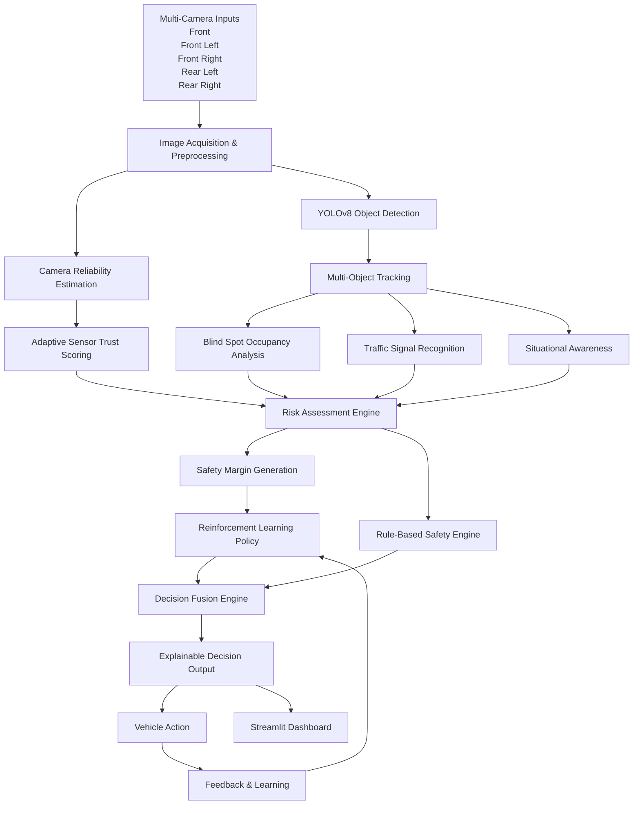
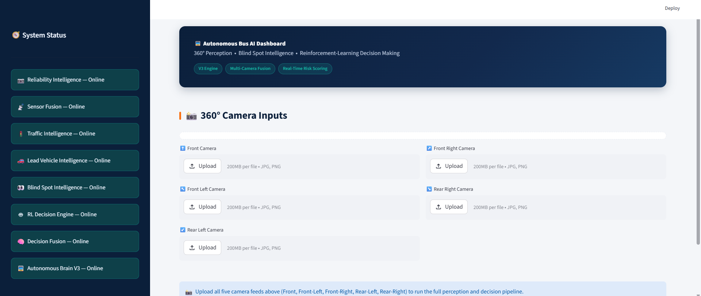
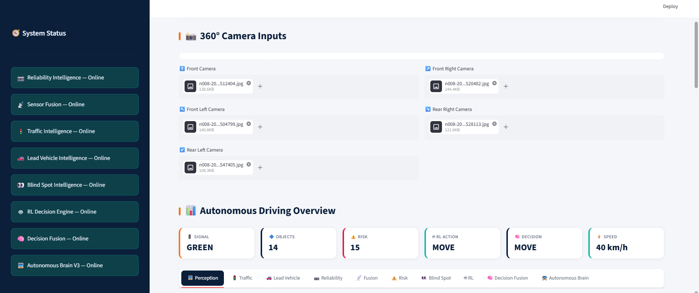
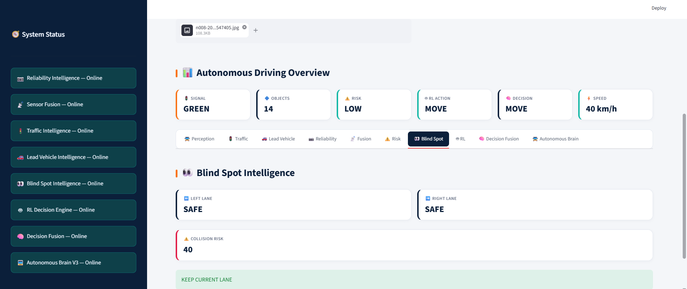
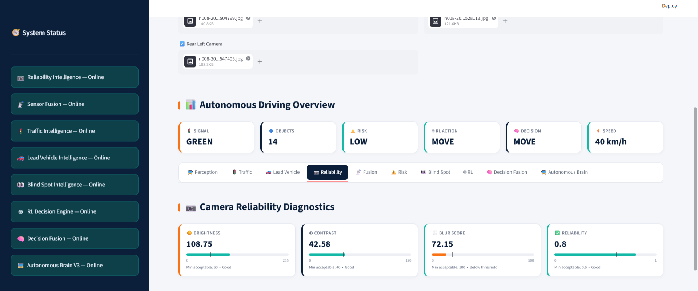

<div align="center">

# 🚍 Reinforcement Learning–Driven Autonomous Urban Bus Perception & Decision System

**An intelligent perception and decision-making framework for autonomous urban buses using YOLOv8, sensor reliability estimation, blind spot analysis, reinforcement learning, and decision fusion.**

[](https://www.python.org/)
[](#)
[](#)
[](#)
[](#)
[](#)
[](#)
[](#)


[🔗 Live Demo](https://rl-adaptive-bus-perception-system-xttxesvbypcbtt6ac2bhwj.streamlit.app/) [**🎥 Screenshots**](#screenshots)

</div>

---

## Overview

This project presents an intelligent perception and decision-making framework for autonomous urban buses. It combines multi-camera computer vision, adaptive sensor reliability estimation, blind spot intelligence, reinforcement learning, and decision fusion to generate safe driving decisions in real time through an interactive Streamlit dashboard.

The system answers four questions on every frame, in real time:
**1**. **What's around the bus?** — 360° object and pedestrian detection across 5 camera feeds
**2**. **Can the sensors be trusted right now?** — adaptive reliability & fusion confidence scoring
**3**. **Is it safe to change lanes?** — blind spot occupancy and collision risk analysis
**4**. **What should the bus do next?** — an RL policy fused with rule-based safety overrides, with full reasoning surfaced for every decision

## Key Features

- 🎥 **360° Multi-Camera Perception** — YOLOv8-based detection across front, front-left, front-right, rear-left, and rear-right feeds
- 🚦 **Traffic Signal Recognition** — HSV-based color classification from detected traffic lights
- 👀 **Blind Spot Intelligence** — lane occupancy and collision risk scoring for safe lane changes
- 📡 **Adaptive Sensor Fusion** — brightness/contrast/blur-based camera reliability, dynamically weighted into a fusion confidence score
- 🤖 **Reinforcement Learning Decision Engine** — policy-driven action selection (`MOVE`, `SLOW_DOWN`, `STOP`, `CHANGE_LEFT`, `CHANGE_RIGHT`) with a rule-based fallback for safety-critical cases
- 🧠 **Decision Fusion Layer** — arbitrates between RL output and risk-based rules to produce a single final decision, speed recommendation, and lane action — each with a human-readable explanation
- 📊 **Live Dashboard** — a Streamlit interface surfacing every subsystem's output and reasoning in real time

## 🏗️ System Architecture



### System Workflow

The proposed autonomous perception framework follows a twelve-stage decision pipeline:

| Stage | Module | Purpose |
|-------|--------|---------|
| 1 | Multi-Camera Image Acquisition | Capture synchronized images from five surrounding cameras. |
| 2 | Object Detection | Detect vehicles, pedestrians, traffic signals, lanes, and surrounding objects using YOLOv8. |
| 3 | Object Tracking | Track detected objects across consecutive frames to estimate trajectories and motion. |
| 4 | Reliability Estimation | Evaluate image quality and perception confidence using brightness, blur, contrast, visibility, and environmental conditions. |
| 5 | Sensor Trust Computation | Assign adaptive reliability weights to each camera before sensor fusion. |
| 6 | Blind Spot Analysis | Predict blind spot occupancy and identify potential collision risks during lane changes. |
| 7 | Risk Assessment | Combine environmental context, detected objects, blind spot information, and sensor confidence to estimate driving risk. |
| 8 | Safety Margin Generation | Calculate adaptive speed limits, following distance, lane gap, and safety margins based on estimated risk. |
| 9 | Reinforcement Learning Policy | Select an optimal driving action such as MOVE, SLOW_DOWN, STOP, CHANGE_LEFT, or CHANGE_RIGHT. |
| 10 | Decision Fusion | Fuse reinforcement learning recommendations with deterministic safety rules to obtain the safest decision. |
| 11 | Explainable Decision Generation | Produce the final decision along with confidence score and reasoning for user interpretation. |
| 12 | Vehicle Execution & Feedback | Execute the selected action and use the outcome as feedback for future policy improvement. |

## Tech Stack

| Layer | Technology |
|---|---|
| Object Detection | YOLOv8 (Ultralytics) |
| Computer Vision | OpenCV, NumPy |
| Decision Logic | Custom rule-based + RL policy engine |
| Data Handling | Pandas |
| Frontend | Streamlit |
| Deployment | Streamlit Community Cloud |


## 📸 Project Screenshots

The following screenshots demonstrate the complete perception-to-decision pipeline of the proposed autonomous urban bus navigation system.

| Dashboard | Multi-Camera Analysis |
|-----------|-----------------------|
|  |  |

| Blind Spot Intelligence | Camera Reliability |
|-------------------------|--------------------|
|  |  |

| Final Decision Output |
|-----------------------|
|  |

## Project Structure

```
.
├── src/                  # Core perception, risk, fusion & RL modules
│   ├── risk_based_decision_engine.py
│   ├── blind_spot_intelligence.py
│   ├── decision_fusion_engine.py
│   ├── pedestrian_intelligence.py
│   └── autonomous_brain_v3.py
├── frontend/             # Streamlit dashboard
│   └── app_v3.py
├── models/               # Model weights / config (large weights git-ignored)
├── docs/                 # Architecture notes and design documentation
├── screenshots/          # Dashboard screenshots for this README
├── requirements.txt
├── packages.txt          # Linux system deps for Streamlit Cloud
└── README.md
```

## 🔒 Intellectual Property Notice

This repository is provided solely for academic, research, and portfolio purposes.

The underlying methodology, system architecture, algorithms, and decision-making framework are currently under the patent application process.

The source code is **not licensed for reproduction, redistribution, commercial use, or derivative works** without prior written permission from the author.

For collaboration, research discussions, or demonstration requests, please contact the author directly.

## Datasets Referenced

This project's reliability and fusion modules were developed and validated against publicly available autonomous driving datasets, including **BDD100K** and **nuScenes**. Datasets are not bundled in this repository.

## 🚀 Future Scope

The current implementation establishes a robust framework for adaptive perception and intelligent decision-making in autonomous urban buses.

Future enhancements and research directions are intentionally not disclosed while the associated intellectual property is under the patent application process.

## 👩‍💻 Author

**Radhika D Chougale**  
B.E. Computer Science (Data Science) Student  
Dayananda Sagar Academy of Technology and Management (DSATM), Bengaluru

Passionate about **Machine Learning, Computer Vision, Reinforcement Learning, Autonomous Systems, and AI-driven Decision Intelligence**.

📧 **Email:** dcradhika004@gmail.com  
💼 **LinkedIn:** https://www.linkedin.com/in/radhika-d-chougale-7a2a53294/

> *This project is part of my research and is currently under the patent application process.*
